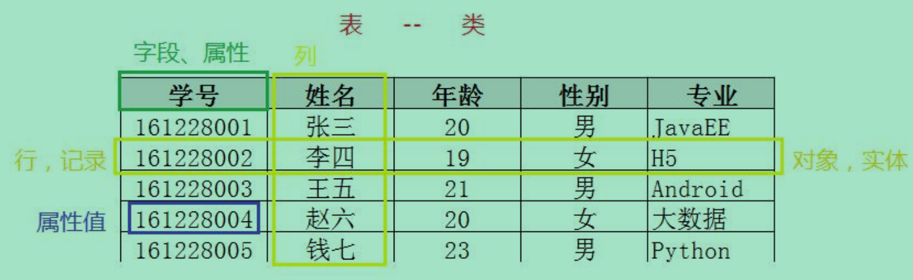

# 数据库的概念
## 1. 为什么要使用数据库？

   答：数据持久化的需要：使用数据库可以将内存中的数据（临时数据）保存到掉电式的内存设备中，从而实现数据的持久化，以供之后使用。持久化的大多数时候是将数据储存在数据库中，当然也可以储存在磁盘文件或者一些其他特定格式的文件中如：`TXT、XML`

   方便数据管理：将数据以数据库的以特定格式和特定关系保存数据，可以更方便的调用数据、方便检索以及管理数据

## 2. 什么是数据库？

   DB（DATABASE）：数据库是储存数据的仓库，保存着一系列有组织的数据。

   DBMS(DATABASE Management System):数据库管理系统是操纵和管理数据库的大型软件。例如：建立数据库、使用数据库、维护数据库。

   目前互联网上常见的数据库管理软件有 `Sybase、DB2、Oracle、MySQL、Access、Visual Foxpro（面向对象型）、`
   `MS SQL Server、Informix、PostgreSQL`（对象-关系型）这几种。

## 3.什么是`MySQL`？`MySQL`是数据库吗？

`MySQL`严格讲不是数据库，`MySQL`是数据库管理系统，是一种开源（开放源码）的关系型数据库管理系统，开发者为瑞典的`MySQLAB`公司，在2008年被SUN公司收购，SUN后又被Oracle公司收购。
`MySQL`数据库，因为体积小、速度快、总体拥有成本低，尤其是开源的特点被很多网站和公司选择，如：`YouTube、Facebook、Twitter`等

## 4. 什么是关系型数据库？

   关系型数据库也是储存数据的数据库，但是它是以二维表格（行与列）来储存数据的，以一种以行与列排列的具有相关信息的逻辑组，类似excel表。一个数据库可以包含任意多个数据表。表中的一行代表一条记录，反映一个实体的相关多个信息，比如一个人的身份证、年龄、身高、学历排列的一行对应着：3222222、25、175、本科。数据表中的每一列称为一个字段。表是由其包含的各种字段定义的，每个字段描述了它所含有数据的意义，数据表的设计实际上就是对字段的设计。创建数据表时为每个字段分配一个数据类型，定义其长度和其他属性。行与列交叉的位置表示某个属性值，也就是说：年龄：25。

   

## 5. `SQL`是一种结构化查询语言，那么什么是结构化查询语言？

       `SQL`是一种特殊目的的编程语言，是一种数据库查询和程序设计语言，用于存取数据以及查询、更新和管理关系数据库系统